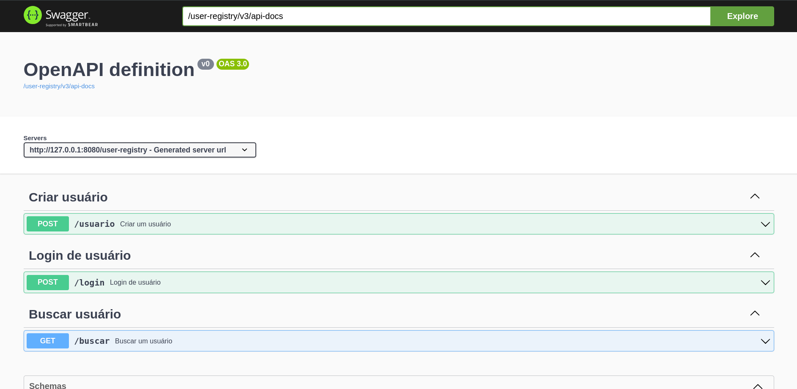

# Aplicação de registro de usuários

Este projeto é uma aplicação de registro de usuários, construída com Java e Spring Boot, que utiliza PostgreSQL como banco de dados.
### Executar a aplicação backend 

Pré-requisitos

 -  Java 17
 -  Maven
 -  PostgreSQL

- Executar os comandos maven :

 mvn clean install
   
 mvn spring-boot:run


# [Repositório da interface da aplicação](https://github.com/sleevs/ui-app) 


# Para acessar a API da aplicação:
http://127.0.0.1:8080/user-registry/swagger-ui/index.html




### Aternative para executar a aplicação backend com Docker

Pré-requisitos

- Docker instalados na sua máquina.


- Executar o docker-compose file :

   docker-compose up --build

```
version: '3.8'

services:
  user-registry:
    build:
      context: .
      dockerfile: Dockerfile
    ports:
      - "8080:8080"
    environment:
      - SPRING_DATASOURCE_URL=jdbc:postgresql://postgres:5432/postgres
      - SPRING_DATASOURCE_USERNAME=postgres
      - SPRING_DATASOURCE_PASSWORD=postgres
      - SPRING_APPLICATION_NAME=user-registry

  postgres:
    image: postgres:15
    container_name: postgres_db
    environment:
      POSTGRES_USER: postgres
      POSTGRES_PASSWORD: postgres
      POSTGRES_DB: postgres
    ports:
      - "3003:5432"
    volumes:
      - postgres_data:/var/lib/postgresql/data

volumes:
  postgres_data:
    driver: local

```
